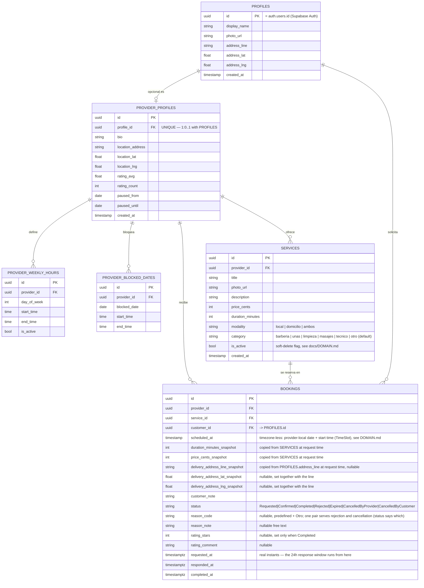

# Booqi Database Design

**Backend decided: Supabase** (Postgres + Auth + Realtime, no custom API — same pattern as the
sibling `menu-platform` project). This resolves Issue #8. Reasoning:

- Our domain model already assumes normalized, ID-referenced aggregates (`docs/DOMAIN.md` § the
  rule that matters), which is how a relational database thinks — not how a NoSQL document store
  (e.g. Firestore) wants to be used.
- Supabase Auth natively supports the 4 methods already confirmed (Google, Facebook, Apple ID,
  email/password).
- Realtime subscriptions cover "Provider gets notified the instant a request comes in" /
  "Customer sees the accept/reject the instant it happens" without a separate notification system.
- `supabase-kt` gives a mature Kotlin Multiplatform client — fits the existing stack directly.

## Entity-relationship diagram

Normalized to 3NF: every table has a UUID primary key, every attribute depends on that key alone
(no repeating groups — that's why `provider_weekly_hours` and `provider_blocked_dates` are their
own tables, not list-columns on `provider_profiles`), and there are no transitive dependencies.

## Table-by-table rationale

| Table | Why it's shaped this way |
|---|---|
| `profiles` | 1:1 extension of Supabase's own `auth.users` (id is the same UUID). Holds the single saved address as plain columns, not a separate table — we explicitly decided one address per user, not a list, so a separate table would be over-normalized for no benefit. |
| `provider_profiles` | Separate from `profiles` (not columns on it) because it's optional/sparse — most rows in `profiles` would have all-null provider columns otherwise. `profile_id` is `UNIQUE` to enforce the 1:0..1 relationship at the DB level, not just in application code. |
| `provider_weekly_hours` | One row per day-of-week per provider. Modeling this as a JSON blob or 7 columns on `provider_profiles` would violate 1NF (repeating group) and make querying "who's open Tuesdays at 3pm" require unpacking JSON instead of a plain `WHERE`. |
| `provider_blocked_dates` | Same reasoning — a provider can have any number of blocked dates, so it's a child table, not a list column. |
| `services` | `category` is the C1 chip (a Postgres `ENUM` later, like `modality`; unknown values read as `otro`). `provider_profiles.location_lat/lng` are nullable: the Catalog's distance filter skips providers without them. `is_active` is a soft-delete flag, not a row deletion — per `docs/DOMAIN.md`, hard-deleting a `Service` would orphan `bookings.service_id` on historical (including completed) bookings. |
| `bookings` | The `_snapshot` fields exist because `docs/DOMAIN.md` requires a booking to freeze the price/duration/address at request time — if we instead read live from `services`/`profiles` every time, a price change would retroactively alter what a past customer agreed to pay. `rating_stars`/`rating_comment` are embedded here rather than a separate `ratings` table because a rating is 1:1 with a completed booking and has no independent lifecycle of its own (still valid 3NF: both columns depend on nothing but `bookings.id`). |

## Not yet done

- Actual `CREATE TABLE` DDL + Postgres `ENUM` types for `modality`/`status`/`reason_code`
- Row Level Security (RLS) policies (e.g. a provider can only see bookings for their own
  `provider_id`; a customer can only see their own `customer_id` rows)
- Indexes (obvious candidates: `bookings.provider_id`, `bookings.customer_id`,
  `bookings.scheduled_at`, `services.provider_id`)
- Wiring `supabase-kt` into `core:network` and replacing the fake datasources in `data/*` with
  real Supabase-backed ones
